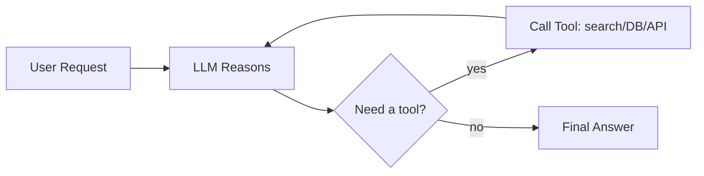
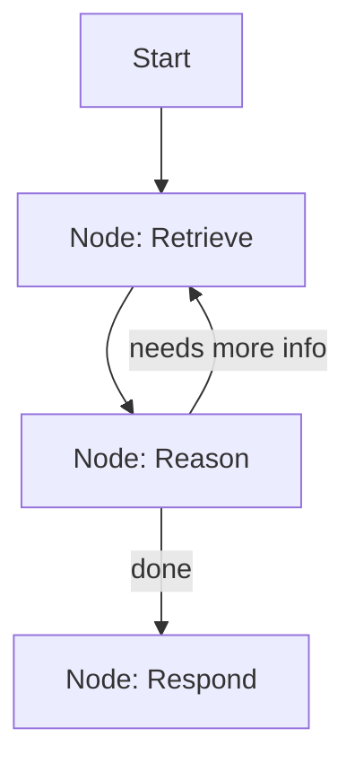
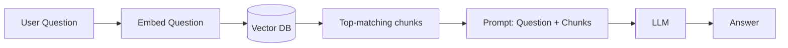
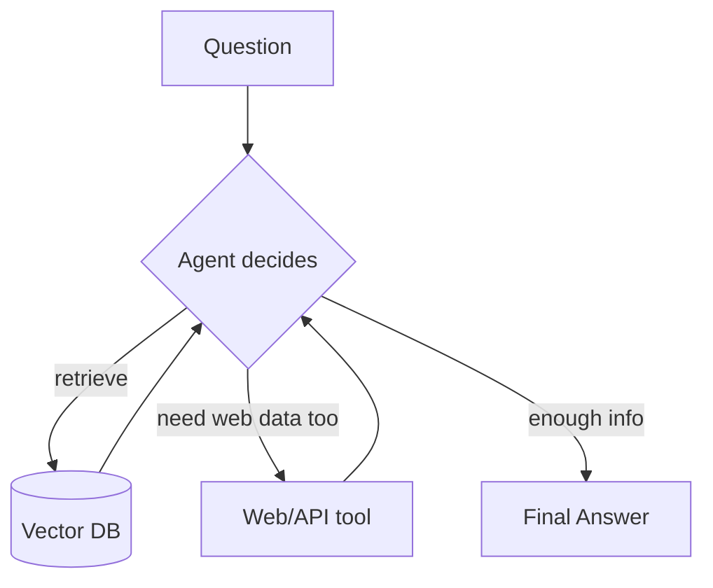

# Agentic AI — Core Concepts

A quick-reference guide for anyone who knows software but hasn't touched LLM/agent tooling yet.

---

## 1. LLM Basics — Tokens, Params, Model Size

**Tokens** are chunks of text (roughly ¾ of a word in English). "Hello world" ≈ 2 tokens.
LLMs don't read letters — they read token IDs (numbers).

- **Input tokens**: your prompt + context you feed in
- **Output tokens**: what the model generates
- **Context window**: max tokens (input + output combined) a model can "see" at once (e.g. 128K, 200K, 1M tokens)
- **Cost/usage** = (input tokens × input price) + (output tokens × output price) — this is why long documents or chat history get expensive fast

**Parameters ("params")** are the internal weights the model learned during training — think of them as the "knowledge dials." A "7B model" has 7 billion of these.

| Size | Rough meaning |
|---|---|
| ~1-3B | Fast, cheap, runs on a laptop/phone, weaker reasoning |
| ~7-13B | Good balance, still self-hostable |
| ~70B+ | Strong reasoning, needs serious GPUs |
| 100B+ (GPT-4/Claude class, often undisclosed) | Frontier reasoning, hosted via API |

**Significance:** more params = generally better reasoning/knowledge, but slower & costlier. This is *not* the only lever anymore — training data quality, fine-tuning, and reasoning techniques matter as much as raw size today.

---

## 2. What Is an "Agent"?

A plain LLM call is a **question → answer**. It can't take actions or check facts.

An **agent** = LLM + ability to:
1. Decide *what to do* (reason)
2. Call a **tool** (search the web, query a DB, hit an API, run code)
3. Look at the tool's result
4. Repeat until it has a final answer

This loop (reason → act → observe → repeat) is often called **ReAct**.

**How you actually build one:**
- Define tools (Python functions with clear descriptions)
- Give the LLM the tool list — it decides *when* and *with what arguments* to call them ("function calling")
- Your code executes the tool, feeds the result back to the LLM
- A framework (LangChain/LangGraph, below) usually manages this loop for you

---

## 3. LangChain vs LangGraph

Both are Python frameworks for building LLM apps — they solve different problems.

| | LangChain | LangGraph |
|---|---|---|
| What it is | Toolkit of building blocks (prompts, chains, tool wrappers, memory) | Framework for building the agent's **control flow** as a graph |
| Best for | Simple, mostly-linear pipelines (prompt → LLM → parse) | Complex agents needing loops, branching, retries, multi-agent handoffs |
| Mental model | A pipeline / recipe | A **state machine** (nodes = steps, edges = "what happens next") |
| Relationship | LangGraph is built by the same team, and typically *uses* LangChain components inside its nodes | — |

*A LangGraph graph — the loop and branching is explicit, unlike a straight LangChain pipeline.*

---

## 4. RAG (Retrieval-Augmented Generation)

LLMs only know what they were trained on — nothing private, nothing recent. **RAG** fixes this by fetching relevant info first, then asking the LLM to answer *using it*.

**Key pieces:**

- **Chunking** — splitting big documents into smaller pieces (e.g. 500-1000 tokens each) so retrieval is precise and fits context limits.
- **Embedding** — converting a chunk of text into a list of numbers (a vector) that captures its *meaning*. Similar meaning → similar vector.
- **Vector DB** — a database built to store these vectors and quickly find the "closest" ones to a query vector (similarity search). **Qdrant** is one such vector DB (others: Pinecone, Weaviate, FAISS, Chroma).
- **Retrieval** — embed the user's question, search the vector DB, pull back the top-N most relevant chunks.

So the pipeline is: **document → chunk → embed → store in vector DB → (later) embed query → retrieve → feed to LLM.**

---

## 5. Agentic RAG

Regular RAG = one retrieval pass, then answer. It's a straight line.

**Agentic RAG** = the agent *decides* when/what to retrieve, can retrieve multiple times, re-query if results are weak, combine multiple sources, or skip retrieval entirely if not needed.

In short: **RAG is a fixed pipeline. Agentic RAG is RAG as one tool among many, orchestrated by reasoning.**

---

## 6. Putting It Together — What's Missing?

Things worth a one-liner if he asks, or to show you know the full picture:

- **Fine-tuning** vs **prompting**: fine-tuning retrains weights on your data (expensive, rare); most apps just engineer better prompts + RAG instead.
- **Function/Tool calling**: the mechanism that lets an LLM output structured "call this function with these args" — the backbone of agents.
- **Multi-agent systems**: multiple specialized agents (e.g. researcher, writer, reviewer) coordinating — LangGraph is often used for this.
- **Memory**: short-term (conversation history) vs long-term (stored facts, often via a vector DB again).
- **Evaluation/guardrails**: checking agent outputs for correctness/safety before they reach a user — increasingly important as agents take real actions.
- **MCP (Model Context Protocol)**: an emerging standard for plugging tools/data sources into any LLM app in a consistent way — worth a mention as "where this is heading."

---

## 7. One-Slide Summary

> An **LLM** predicts text token-by-token. Give it **tools** and a decision loop → it's an **agent**. Give it a **memory of your documents** via chunking + embeddings + a vector DB → that's **RAG**. Combine both, letting it decide *when* to retrieve → **Agentic RAG**. **LangChain/LangGraph** are just the scaffolding that wires all this together in code.
